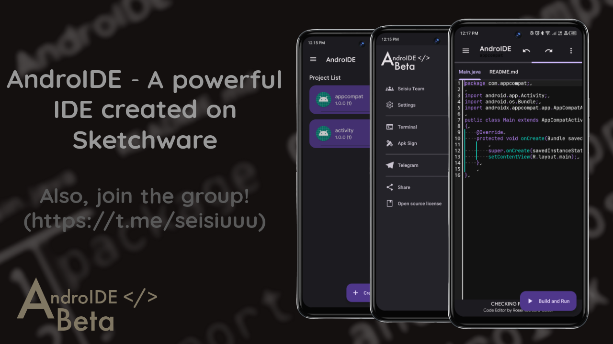
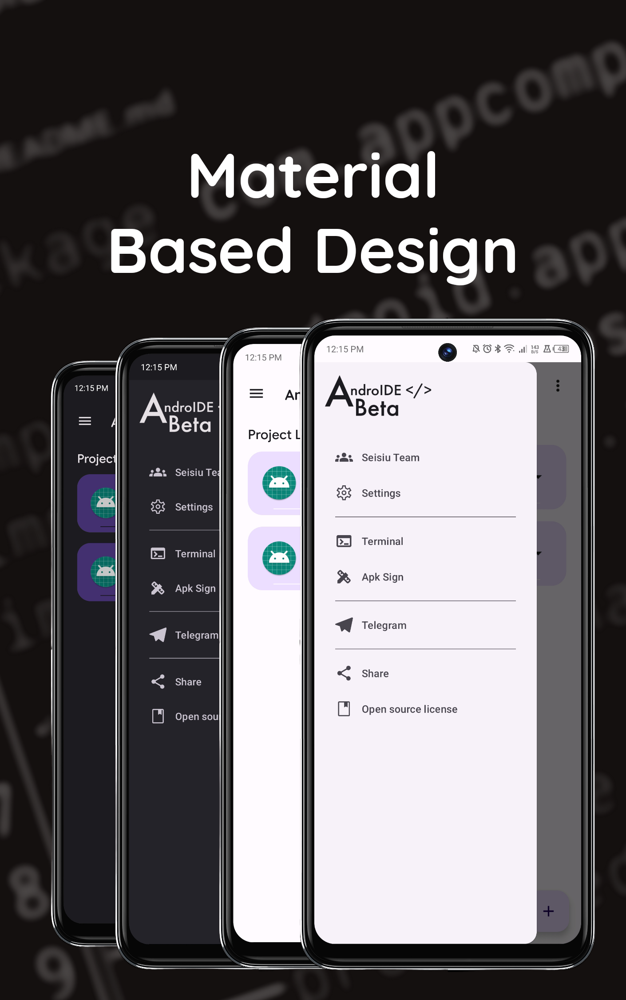
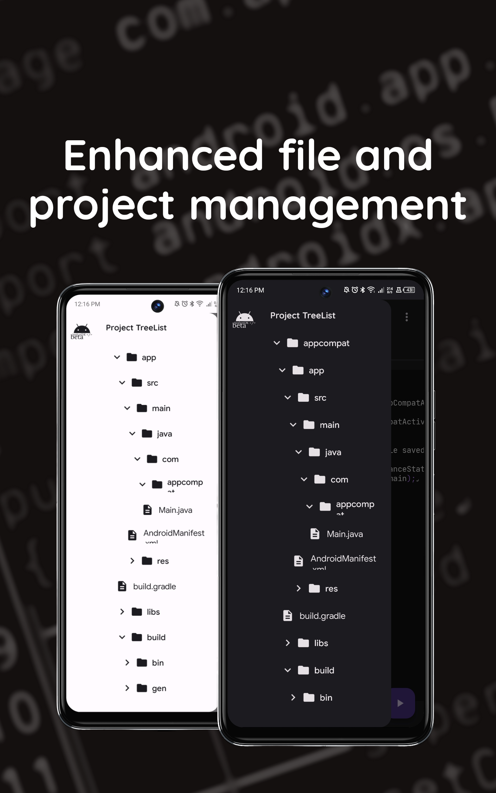
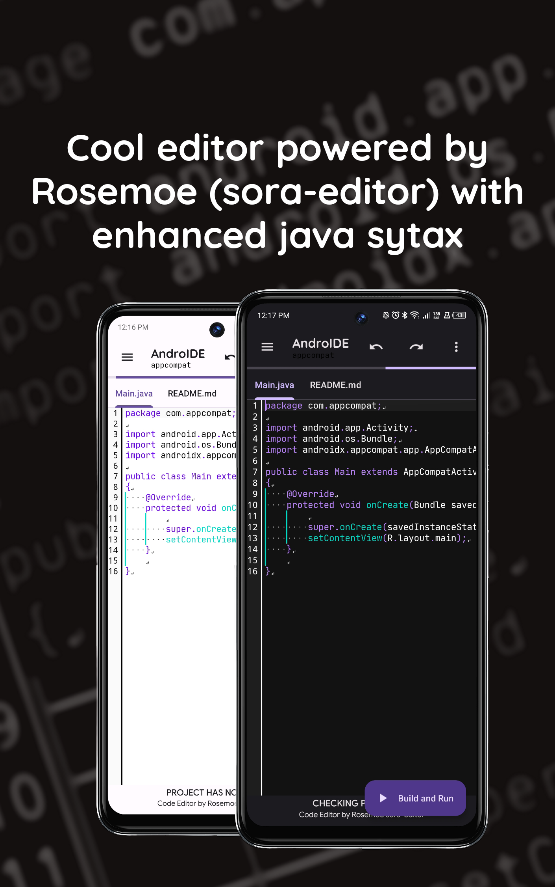

# AndroIDE
**AndroIDE** is a powerful IDE created on Sketchware!


# What are the main funtions?
- **1)** You can build application just like any normal IDE's do.
- **2)** Enhanced `java` syntax highlighting.
- **3)** Enhanced support for file management.

# Screenshots
  
  
  


# Pros & Cons
**Pros**: 
- Literally everything!

**Cons**:
- Gradle not supported.
- ~~Downloading of dependency's are manual.~~
- Drag & Drop unsupported for now...

# How to use?
**Change of application project settings**
- You can change it by locating the app_config.json.
- After you located the app_config.json, go and open it.
- Inside the app_config.json, you will find something like this:
```JSON
{"minSdkVersion":21,"package":"com.appcompat","viewBindingEnabled":true,"libraries":"[]","useR8":true,"targetSdkVersion":29,"versionName":"1.0","versionCode":1,"zipAlignEnabled":true}
```
- And after that, you can now edit your application's configuration.
